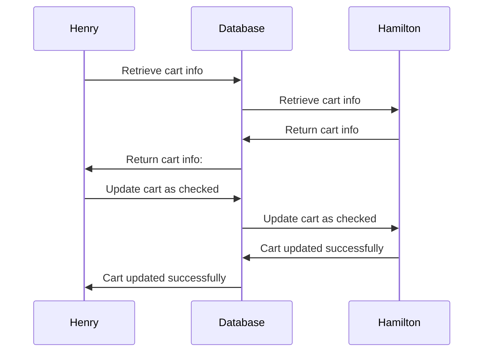

# Case 1: 

**Phenomenon:**
Type of Concurrency Issue: Lost Update

**Scenario:** 
Let's say two users, Henry and Hamilton, are simultaneously trying to check out the same cart with card ID 123. 

1. Henry retrieves the cart information for cart ID 123.
2. At the same time, Hamilton also retrieves the cart information for cart ID 123.
3. Henry updates the cart status to "checked out" and completes the checkout process.
4. Hamilton, unaware of Henry's changes, also updates the cart status to "checked out" and completes the checkout process.
5. Hamilton's update overwrites Henry's changes, resulting in a lost update.

**Sequence Diagram: still making it in progress**



**Solution:**
In this example, the changes made by Henry are lost because Hamilton's update overwrites them without considering the intermediate state. To fix this issue, we can use a "SELECT FOR UPDATE" statement to lock the cart record before updating it.

# Case 2: 

**Phenomenon:**

**Scenario:** 

**Sequence Diagram:**
```mermaid
sequenceDiagram  
```

**Solution:**

# Case 3: 
# Concurrent Task Update (Lost Update)

**Phenomenon:**

**Scenario:** 

**Sequence Diagram:**
```mermaid
sequenceDiagram  
```

**Solution:**


