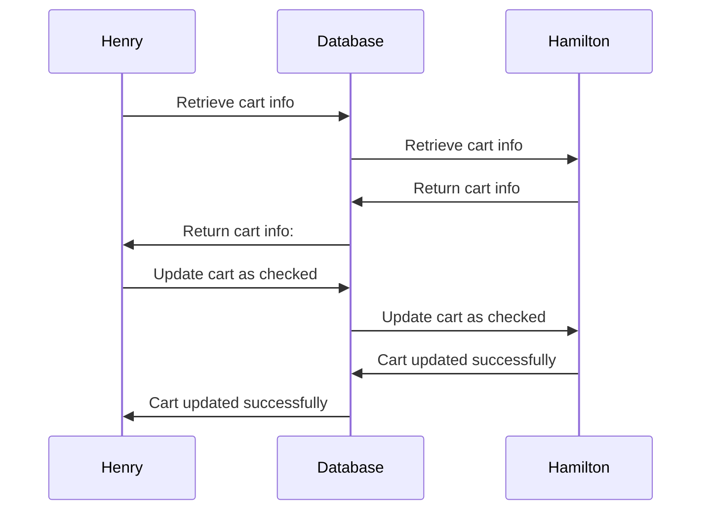
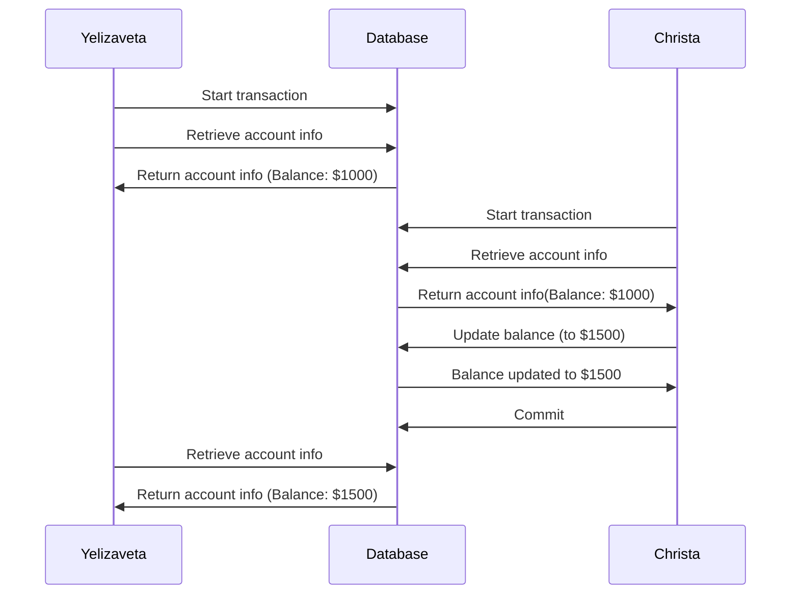

# Case 1: 

**Phenomenon:**
Type of Concurrency Issue: Lost Update

**Scenario:** 
Let's say two users, Henry and Hamilton, are simultaneously trying to check out the same cart with card ID 123. 

1. Henry retrieves the cart information for cart ID 123.
2. At the same time, Hamilton also retrieves the cart information for cart ID 123.
3. Henry updates the cart status to "checked out" and completes the checkout process.
4. Hamilton, unaware of Henry's changes, also updates the cart status to "checked out" and completes the checkout process.
5. Hamilton's update overwrites Henry's changes, resulting in a lost update.

**Sequence Diagram: still making it in progress**



**Solution:**
In this example, the changes made by Henry are lost because Hamilton's update overwrites them without considering the intermediate state. To fix this issue, we can use a "SELECT FOR UPDATE" statement to lock the cart record before updating it.

# Case 2: 
Scenario 2 with the names Yelizaveta and Christa:

**Phenomenon:**
Non-Repeatable Read

**Scenario:** 
Let's say two users, Yelizaveta and Christa, are accessing the account information for the same user simultaneously.

Yelizaveta starts a transaction and retrieves the account information for user ID 1.
Christa starts a separate transaction and also retrieves the account information for user ID 1.
Yelizaveta's transaction reads the account balance as $1000.
Christa's transaction updates the account balance to $1500 and commits the changes.
Yelizaveta's transaction reads the account balance again, expecting to see $1000, but instead retrieves the updated balance of $1500.

**Sequence Diagram:**


**Solution:**
To address the non-repeatable read issue, we can use the REPEATABLE READ isolation level for Yelizaveta's transaction. This ensures that Yelizaveta's transaction sees a consistent snapshot of the data throughout its execution. 

# Case 3: 
Scenario 3 with the names Liam and Noah:

**Phenomenon:**
Phenomenon: Phantom Read

**Scenario:** 
Let's say two users, Liam and Noah, are working with a task management system simultaneously.

Liam starts a transaction and retrieves a list of tasks assigned to him.
Noah starts a separate transaction and adds a new task to Liam's task list.
Noah commits his transaction, making the new task visible to others.
Liam's transaction queries the task list again, expecting to see the same set of tasks as before.
However, Liam's transaction now retrieves the updated task list, which includes the newly added task by Noah.

**Sequence Diagram:**
```mermaid
sequenceDiagram  

```

**Solution:**
To prevent phantom reads, you can use the SERIALIZABLE isolation level for Liam's transaction. This ensures that Liam's transaction sees a consistent snapshot of the data and prevents other transactions from introducing new rows that would affect Liam's transaction. 